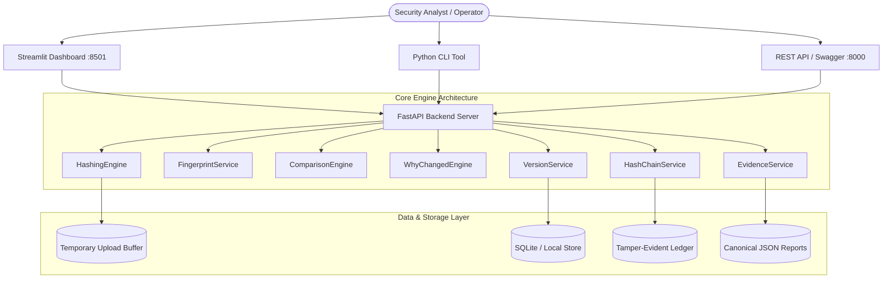

# HASHLENS — File Integrity & Hash Forensics Platform

[](https://github.com/2300031984/HASHLENS/actions)
[](#)
[](https://www.python.org/)
[](https://fastapi.tiangolo.com/)
[](https://streamlit.io/)
[](https://opensource.org/licenses/MIT)

**HASHLENS** is a local-first file integrity and hash-forensics platform built for security engineers, incident responders, and forensic analysts. It integrates streaming multi-algorithm cryptographic hashing, chunk-level block fingerprinting, version history tracking, deterministic diff classification, tamper-evident ledger chaining, and canonical evidence report generation into a unified workflow.

Rather than acting as a simple isolated hash calculator, HASHLENS provides an integrated forensic engine that answers the critical incident response question: **"Why did my file's hash change?"**

---

## Key Capabilities

- **Multi-Algorithm Cryptographic Hashing:** Concurrent streaming computation of MD5, SHA-1, SHA-256, and SHA-512 for text inputs and streaming file uploads.
- **Chunk-Level Fingerprinting:** Fixed-size block mapping to isolate modified byte ranges without loading entire files into memory.
- **Forensic File Comparison:** Automated 7-tier classification engine (`NO_CHANGE`, `CONTENT_MODIFICATION`, `SIZE_CHANGE`, `MAJOR_REPLACEMENT`, `INCONCLUSIVE`, `METADATA_CHANGE`).
- **"Why Did My Hash Change?" Engine:** Rule-driven diagnostic analysis that translates chunk diffs, size shifts, and header signatures into plain-language forensic assessments.
- **Version History Tracking:** Historical file baseline repository tracking hash evolution across file revisions.
- **Tamper-Evident Hash Chain:** Cryptographic linked-list ledger maintaining append-only audit histories with active tamper detection (`CHAIN_VALID` vs `CHAIN_BROKEN`).
- **Certified Evidence Reports:** Deterministic canonical JSON SHA-256 digest calculation (`EvidenceService.compute_report_hash()`) and independent verification.
- **REST API:** Production FastAPI backend complete with interactive OpenAPI / Swagger UI documentation (`/docs`).
- **Forensic Dashboard:** Interactive Streamlit web interface for visual hash inspection, diff analysis, chain ledger auditing, and evidence export.
- **CLI Utility:** Native Python command-line interface for headless automation and script integration.
- **Dockerized Architecture:** Multi-stage containerization using Docker Compose with non-root security principles.

---

## Architecture Overview



### Core Engine Components
- `HashingEngine`: Manages multi-algorithm streaming hashers (`hashlib`).
- `FingerprintService`: Calculates fixed-size block fingerprints and magic-byte advisories.
- `ComparisonEngine`: Performs set differential logic over chunk maps.
- `WhyChangedEngine`: Evaluates rule sets to produce human-readable diagnostic reports.
- `VersionService`: Manages file revision history and baseline associations.
- `HashChainService`: Maintains linked-list ledger digests (`previous_record_hash`).
- `EvidenceService`: Generates canonical JSON SHA-256 evidence reports.

---

## Security Architecture & Controls

HASHLENS incorporates defense-in-depth security controls verified during release testing:

- **Path Traversal Protection:** Input filenames are strictly sanitized using `Path(filename).name` boundary isolation.
- **Null-Byte Neutralization:** Filenames containing null-bytes (`\0`) or control characters are rejected or sanitized.
- **Upload Size Limits:** Streamed file uploads are enforced by middleware up to `MAX_UPLOAD_SIZE` (100 MB default).
- **Temporary Data Cleanup:** Temporary file streams are deleted immediately after digest calculation.
- **Inert Storage Execution Protection:** Uploaded files are treated strictly as inert binary data blobs with execution bits disabled.
- **In-Memory Rate Limiting:** Client IP sliding-window rate limiter prevents request flooding with automatic stale-entry eviction (>1,000 active client IPs).
- **Security Headers Middleware:** Enforces `Content-Security-Policy`, `X-Content-Type-Options: nosniff`, `X-Frame-Options: DENY`, and `Referrer-Policy`.
- **Environment-Controlled HSTS:** `ENABLE_HSTS` toggle enables `Strict-Transport-Security` for HTTPS production environments while preserving plain HTTP local development.
- **Information Disclosure Prevention:** Production exception handlers sanitize error outputs, preventing internal stack trace disclosure in API responses.

Detailed verification evidence is documented in [`docs/security-test-report.md`](file:///d:/CyberTools/HashLens/docs/security-test-report.md).

---

## Release Validation Summary

HASHLENS has undergone comprehensive functional, security, forensic, dependency, and performance validation:

| Assessment Area | Results / Status | Details |
|---|---|---|
| **Phase 5 Live Production Acceptance** | **25 / 25 PASS** | Complete live production verification suite (`scripts/verify_production.py`). |
| **Automated Unit & API Tests** | **70 / 70 PASS** | Full Pytest suite covering auth, IDOR, PostgreSQL, security, hashing, fingerprinting, and ledgers. |
| **Acceptance Demo Workflow** | **13 / 13 PASS** | End-to-end acceptance script (`python scripts/demo.py`) executed cleanly. |
| **Manual API Security Fuzzing** | **15 / 15 PASS** | Validated path traversal, malformed payloads, rate limits, oversize uploads, and methods. |
| **Forensic Comparison Scenarios** | **7 / 7 PASS** | Verified `NO_CHANGE`, `CONTENT_MODIFICATION`, `SIZE_CHANGE`, `MAJOR_REPLACEMENT`, etc. |
| **Hash Chain Tamper Simulation** | **5 / 5 PASS** | Verified `CHAIN_VALID` for clean state and `CHAIN_BROKEN` for tampered payloads/links. |
| **Dependency Vulnerabilities** | **0 Known CVEs** | `pip-audit` scan returned 0 known vulnerabilities on core backend dependencies. |
| **Static Code Security** | **Bandit Reviewed** | AST scan reviewed; 0 HIGH/HIGH issues; intentional MD5/SHA-1 legacy support preserved. |
| **Docker Build & Health** | **PASS** | Multi-stage Docker Compose services built and verified non-root execution. |

---

## Installation & Setup

### Prerequisites
- Python 3.11+
- Git
- Docker & Docker Compose (optional for containerized deployment)

### Local Environment Setup
```bash
# Clone the repository
git clone https://github.com/2300031984/HASHLENS.git
cd HASHLENS

# Create and activate virtual environment
python -m venv venv
# On Windows:
venv\Scripts\activate
# On Linux/macOS:
source venv/bin/activate

# Install dependencies
pip install -r backend/requirements.txt
```

---

## Running HASHLENS

### Option 1: Local Development Servers

**Start FastAPI REST Backend:**
```bash
python -m uvicorn backend.app.main:app --host 0.0.0.0 --port 8000
```
- API Base Endpoint: `http://127.0.0.1:8000`
- Interactive OpenAPI / Swagger UI: `http://127.0.0.1:8000/docs`

**Start Streamlit Forensic Dashboard:**
```bash
python -m streamlit run dashboard/app.py --server.port 8501 --server.address 0.0.0.0
```
- Web Dashboard URL: `http://127.0.0.1:8501`

### Option 2: Docker Compose Containerization
```bash
docker compose up --build -d
```
Verify running containers:
```bash
docker compose ps
```

---

## CLI Usage Examples

HASHLENS includes a command-line interface for terminal workflows:

```bash
# Hash a text string across all algorithms
python -m backend.app.cli hash-text "Forensic verification test payload"

# Hash a file on disk with custom algorithm selection
python -m backend.app.cli hash-file sample_data/report.txt --algorithms sha256 sha512

# Generate a chunk fingerprint for a file
python -m backend.app.cli fingerprint sample_data/report.txt --chunk-size 65536

# Compare two files and display diagnostic diff assessment
python -m backend.app.cli compare file_v1.txt file_v2.txt

# Audit the tamper-evident hash chain ledger
python -m backend.app.cli audit-chain

# Run the performance smoketest benchmark
python scripts/perf_smoketest.py
```

---

## API Documentation

FastAPI automatically serves interactive API documentation at:
- **Swagger UI:** `http://127.0.0.1:8000/docs`
- **ReDoc UI:** `http://127.0.0.1:8000/redoc`

Detailed endpoint definitions and schemas are documented in [`docs/api.md`](file:///d:/CyberTools/HashLens/docs/api.md).

---

## Security Testing & Verification

Local security testing can be re-run using the provided verification scripts:

```bash
# Execute automated test suite
python -m pytest tests/ -v

# Execute acceptance demo script
python scripts/demo.py

# Execute automated security payload validation
python scripts/security_validation.py

# Run static security code scan
bandit -r backend

# Run dependency vulnerability audit
pip-audit -r backend/requirements.txt
```

---

## Technical Limitations

1. **Authorship Claims:** Cryptographic hashes prove data integrity at a specific point in time; they do not natively prove file origin or author identity without asymmetric digital signatures.
2. **Legal Non-Repudiation Boundary:** Canonical JSON SHA-256 digests verify report integrity against tampering; they do not constitute legal non-repudiation without PKI/timestamp authority counter-signatures.
3. **Ledger Architecture Scope:** The hash chain is a **tamper-evident cryptographic ledger** designed for local auditability; it is not a distributed Byzantine fault-tolerant blockchain.
4. **Rate Limiting Scope:** The current implementation uses **process-local in-memory rate limiting**, suitable for single-node deployments. Distributed multi-node clusters require shared cache synchronization (e.g. Redis).
5. **HSTS Configuration:** HSTS is disabled by default (`ENABLE_HSTS=false`) to preserve plain HTTP local development. It must be explicitly enabled (`ENABLE_HSTS=true`) only behind HTTPS TLS-terminating reverse proxies.
6. **File Type Detection Scope:** Magic-byte classification is advisory based on header signatures; it does not replace full deep packet inspection or anti-malware sandboxing.

---

## Future Roadmap

- [ ] **PostgreSQL Persistence Engine:** Production database driver integration for enterprise data scale.
- [ ] **Redis-Backed Distributed Rate Limiting:** Shared rate-limiting store for multi-instance load-balanced deployments.
- [ ] **Asymmetric Digital Signatures:** X.509 / Ed25519 signing for certified evidence packages.
- [ ] **Multi-User Authentication & RBAC:** OAuth2 / OIDC authentication with role-based access control.
- [ ] **Object Storage Integration:** AWS S3 and MinIO blob backends for large-scale file versioning.
- [ ] **Asynchronous Background Workers:** Celery / Redis queue integration for multi-gigabyte forensic file processing.
- [ ] **Forensic Timeline Visualization:** Interactive visual node graphs for complex version evolution trees.

---

## License

This project is licensed under the MIT License - see the [`LICENSE`](file:///d:/CyberTools/HashLens/LICENSE) file for details.

---

## Security & Reporting

For security disclosures and reporting instructions, please review [`SECURITY.md`](file:///d:/CyberTools/HashLens/SECURITY.md).
